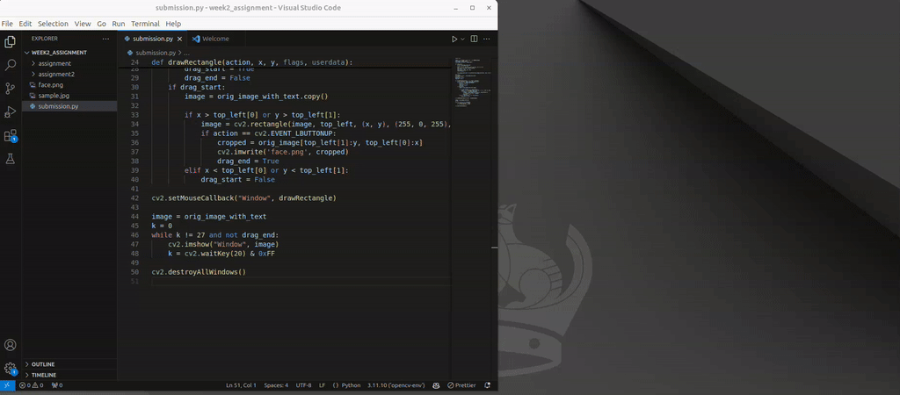

# opencv-doc README

Displayes documentation for OpenCV python commands when you hover your mouse over the keyword.

## Features

It displays the document page for the hovered keword in a webview panel. You can drag out the webview from the tabs, so you can view your code and opencv documentation at the same time. The panel's content will be refreshed when you
hover your mouse over another keyword.

The webview is scrollable and the links are clickable.

[Watch the video in higher resolution](https://youtu.be/dHzHb4Du9wg)

## Known Issues

- The opened webpage can be not what you want. The OpenCV documentation contains
keywords in many different places, sometimes the places is not the most relevant ones. So it is a bit of luck to see the page what you really need.
- The documentation is for OpenCV version 4.10.0. I will try to find a way to switch the version.

## Release Notes

### 1.0.0

Initial release

